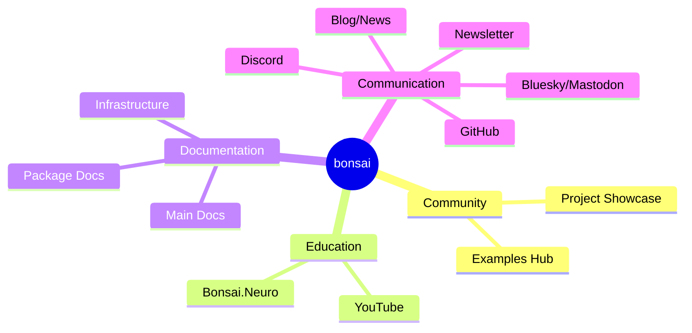

# bonsai_docs_roadmap
A repository for project ideas, roadmaps, and todos to enhance Bonsai documentation and outreach efforts.

# Mindmap

Unfortunately Mermaid.js mindmaps do not yet support clickable links (https://github.com/mermaid-js/mermaid/issues/4099) but the projects can be found on the `Projects` tab.
